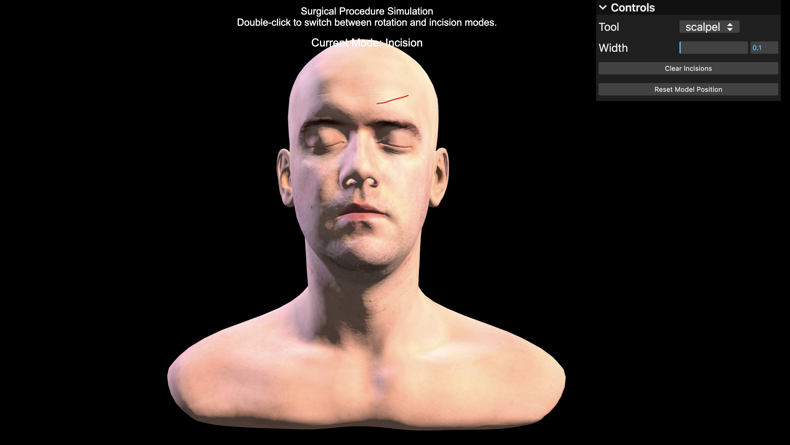
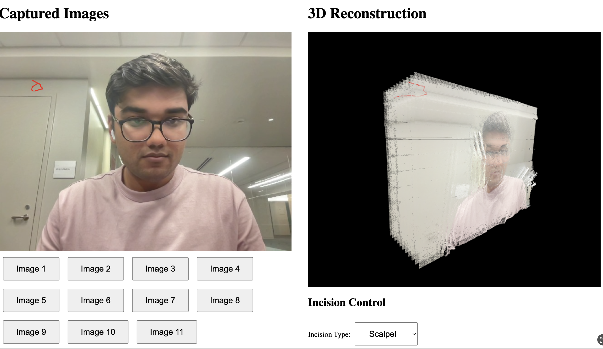
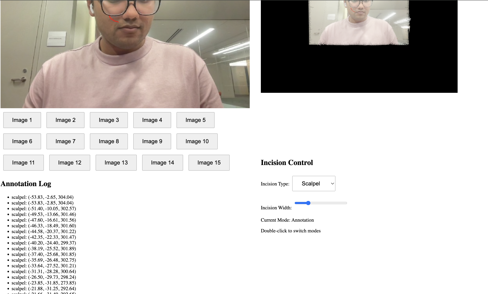

# Noma: Enhancing Remote Surgical Collaboration through Telemedicine

## Inspiration

During our research into healthcare disparities, we uncovered a critical issue: a significant gap in the availability of specialized medical professionals, especially in rural regions of the U.S. This shortage is particularly concerning when it comes to dermatologists performing Mohs Micrographic Surgery (MMS), a precise procedure used to treat skin cancer like Melanoma. Due to this lack of access, rural patients not only experience treatment delays but also face a higher risk of procedural and surgical errors during their treatment.

Our inspiration for Noma emerged from the potential to reduce these errors through telemedicine. By providing surgeons with real-time 3D visualization and automated medical transcriptions, Noma enhances surgical accuracy and ensures that patients, regardless of their location, receive expert, error-free care.

## What It Does

Noma addresses these challenges by enhancing communication between surgeons during Moh's surgery.

### Real-time 3D Facial Visualization:
- Noma creates an interactive 3D visualization of the patient’s face during surgery through a live recording.
- Consulting surgeons can interact with the 3D model and make precise incisions based on real-time updates.

### Automated Medical Transcriptions:
- Noma captures live video and audio from the operating room.
- It generates accurate, time-stamped medical transcriptions, helping document procedures and identify potential errors.

Together, these features enable remote collaboration between rural surgeons and specialists, ensuring high-quality care.

## How We Built It

To build Noma, we integrated several cutting-edge technologies:

### 3D Visualization:
- We tested multiple 3D reconstruction techniques, including **Neural Radiance Fields (NeRF)** and **Gaussian Splatting**.
- We chose **Instant Splat** for its speed and high-quality rendering, ensuring real-time updates during surgery.
- The model takes in an initial video of the patient’s face and outputs a high-quality 3D reconstruction for surgical use.

### Automated Transcriptions:
- We utilized **AWS Transcribe** for speaker diarization, distinguishing between different speakers during surgery.
- **LITA (Language-Image Transformer Agent)** helped us transcribe actions in real-time from the video feed.
- We built a knowledge graph using **Neo4j**, which maps relationships between surgical tools, procedures, and surgeons, updating in real-time using **GraphRAG**.
- This knowledge graph is passed into **Meditron 7B**, an LLM finetuned on medical transcriptions and guidelines, to generate time-stamped medical transcriptions.

By combining these tools, Noma captures real-time events and generates accurate medical documentation.

## Challenges We Faced

- **Generating Real-time 3D Images**: The 3D reconstruction models we tested had inference times of at least 45 minutes, making real-time updates challenging. We instead load an initial scan for consultants to view during surgery.
- **Real-time 3D Rendering**: Achieving high-quality, low-latency 3D facial visualizations was complex due to the need for fast processing during live surgery.
- **Automated Transcription Accuracy**: Integrating transcription tools while maintaining high accuracy in a live setting was difficult, especially when distinguishing between medical terms and procedures.

## What's Next for Noma

- **Extended Medical Use Cases**: We plan to expand Noma beyond Mohs surgery, supporting other critical and complex surgical procedures, such as neurosurgery and cardiovascular surgery. This expansion will increase accessibility to specialized surgical care, especially in underserved regions. Additionally, Noma has potential applications in military medicine, where soldiers in remote or conflict zones often lack access to specialized care. By enabling remote specialists to collaborate in real-time, Noma could help provide life-saving surgeries on the battlefield.

- **Remote and Mobile Surgeries**: Noma can play a pivotal role in facilitating remote surgeries in extreme or isolated environments, such as military operations, disaster zones, or aboard ships and submarines. With real-time 3D visualization and automated documentation, surgeons can receive expert assistance, even in the most challenging settings. This capability has the potential to revolutionize telemedicine for not just rural healthcare but also for humanitarian missions and military deployments.

- **Improved User Experience**: We will continue to optimize the user interface, making it more intuitive and seamless for both primary surgeons and consulting specialists. This improvement will ensure that all users, regardless of their environment or internet connectivity, can collaborate smoothly during surgeries.

- **Further Telemedicine Integrations**: Noma will integrate more robust real-time communication features, such as augmented reality (AR) tools and haptic feedback systems, which will allow remote consultants to provide precise input during surgeries. This integration would further facilitate highly detailed remote guidance, allowing surgeons to receive real-time assistance for incisions, suturing, and complex procedures in environments with limited resources.

## Technologies Used

- **Instant Splat** for real-time 3D visualization
- **AWS Transcribe** for real-time transcription and speaker diarization
- **LITA (Nvidia Labs) (Language-Image Transformer Agent (VLM))** for action transcription
- **Neo4j & GraphRAG** for real-time knowledge graph management
- **Meditron 7B** for medical transcription and documentation
- **Three.js** for 3d modelling
- **React/JS/Python** Languages
  

## Contributors

- **Shrey Gupta** – @Shrey1306
- **Siddhant Agarwal** - @sid0402
- **Abhishek Pillai** – @abhipi

## License

This project is licensed under the MIT License - see the [LICENSE](LICENSE) file for details.

---

