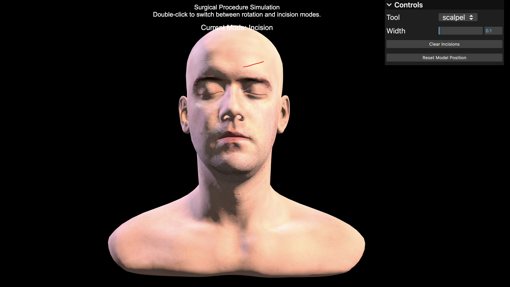

# Noma: Surgical Telemedicine Platform



Noma enhances remote surgical collaboration through real-time 3D visualization and automated medical transcriptions, enabling specialists to provide expert guidance during Mohs Micrographic Surgery.

## Features

### Real-time 3D Facial Visualization
- Interactive 3D visualization of the patient's face during surgery
- Consulting surgeons can interact with the 3D model and make precise incisions
- Built with Three.js and Gaussian Splatting techniques

### Automated Medical Transcriptions
- Captures live video and audio from the operating room
- Generates accurate, time-stamped medical transcriptions
- Knowledge graph construction using Neo4j and GraphRAG

## Project Structure

```
noma/
├── src/noma/                    # Python backend package
│   ├── api/                     # Flask API module
│   │   ├── app.py               # Application factory
│   │   ├── routes.py            # API endpoints
│   │   └── streaming.py         # Video streaming logic
│   ├── rag/                     # RAG module
│   │   ├── graphrag.py          # Neo4j GraphRAG integration
│   │   ├── ehr.py               # EHR Q&A interface
│   │   └── visualization.py     # Graph visualization
│   ├── transcription/           # Transcription module
│   │   └── aws.py               # AWS Transcribe integration
│   ├── config.py                # Configuration management
│   └── __main__.py              # CLI entry point
├── frontend/
│   ├── mesh-viewer/             # React 3D point cloud app
│   │   ├── src/                 # React source files
│   │   └── public/              # Static assets
│   └── incision-tool/           # Three.js incision demo
│       ├── index.html           # Application
│       └── models/              # 3D face model
├── presentation/                # Streamlit demo
├── templates/                   # Flask templates
├── transcripts/                 # Transcript data
├── data/                        # Data files
│   ├── mohs/                    # GraphRAG cache
│   └── patient.pdf              # Sample EHR
├── media/                       # Video files
└── assets/                      # Demo screenshots
```

## Setup

### Prerequisites
- Python 3.11+
- [uv](https://docs.astral.sh/uv/) package manager
- Neo4j database
- AWS account (for transcription)
- OpenAI API key

### Installation

```bash
# Clone the repository
git clone https://github.com/Shrey1306/mona.git
cd mona

# Install dependencies with uv
uv sync

# Copy environment template and configure
cp .env.example .env
# Edit .env with your API keys
```

### Environment Variables

See `.env.example` for required configuration:
- `OPENAI_API_KEY` - OpenAI API key
- `NEO4J_URL`, `NEO4J_USER`, `NEO4J_PASSWORD` - Neo4j database
- `AWS_ACCESS_KEY_ID`, `AWS_SECRET_ACCESS_KEY`, `AWS_S3_BUCKET` - AWS credentials

### Running the Application

```bash
# Start the Flask API (via CLI)
uv run noma

# Or as a module
uv run python -m noma

# Run EHR Q&A interface
uv run noma-ehr
```

### Frontend

```bash
# Mesh viewer (React app)
cd frontend/mesh-viewer
npm install
npm start

# Incision tool (static HTML)
# Open frontend/incision-tool/index.html in browser
```

## API Endpoints

| Endpoint | Method | Description |
|----------|--------|-------------|
| `/` | GET | Main page with video stream |
| `/video_feed` | GET | MJPEG video stream |
| `/text_feed` | GET | SSE text updates |
| `/api/status` | GET | Health check |

## Technologies

- **Instant Splat** - Real-time 3D visualization
- **AWS Transcribe** - Speaker diarization and transcription
- **Neo4j + GraphRAG** - Knowledge graph management
- **Meditron 7B** - Medical domain LLM
- **Three.js** - 3D rendering
- **Flask** - Python web framework

## License

MIT License
